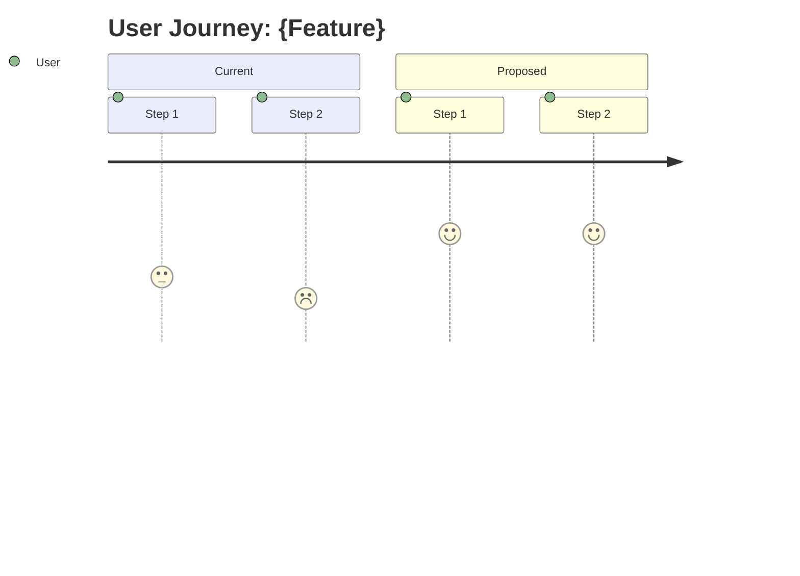
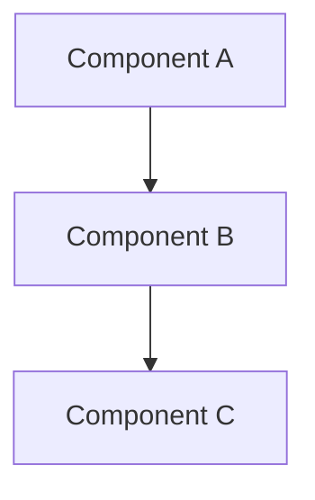
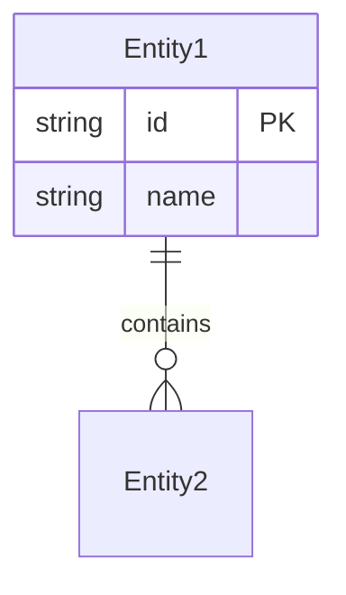
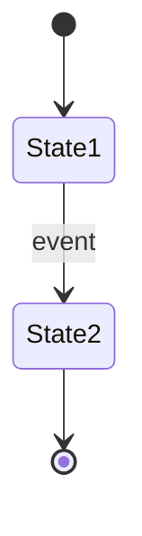

# Feature Design Planning Workflow

**Feature:** $ARGUMENTS

---

## Setup

1. Derive a kebab-case slug from the feature description (e.g., "user authentication system" → `user-auth-system`)
2. Create directory: `designs/{slug}/`
3. Save the original prompt to `designs/{slug}/PROMPT.md`

---

## Phase 1: Discovery & Clarification

Before designing, fully understand the problem space and constraints.

**Exploration Process:**

- Analyze relevant parts of the existing codebase using Read, Glob, Grep tools
- Identify existing patterns, conventions, and architectural decisions
- Map out integration points and dependencies
- Note constraints (technical, business, performance)

**If the feature is clear and well-scoped:**
- Skip to Phase 2 after brief exploration
- Document assumptions in ASSUMPTIONS.md

**If the feature needs clarification:**
- Write questions to `designs/{slug}/QUESTIONS-1.md`
- Wait for user answers before proceeding

**What to clarify:**

- **Functional requirements**: What exactly should this feature do?
- **Non-functional requirements**: Performance, scalability, security constraints?
- **Scope boundaries**: What's in vs. out of scope?
- **User personas**: Who uses this and how?
- **Integration**: How does this interact with existing systems?
- **Success criteria**: How do we know when it's done right?

**Quality of questions matters:**

- Ask about specific behaviors (e.g., "When a user does X, should the system respond with Y or Z?")
- Ask about edge cases (e.g., "What happens when the input exceeds 10MB?")
- Ask about constraints (e.g., "Is there a latency budget for this API?")
- Ask about trade-offs (e.g., "Should we optimize for read performance or write consistency?")
- Be thorough - 5-10 well-thought-out questions is better than 2-3 vague ones

**ITERATIVE Q&A:**

- ASK AS MANY ROUNDS OF QUESTIONS AS YOU NEED
- QUESTIONS-1 → answers → QUESTIONS-2 → answers → etc.
- Only proceed to design when confident you understand the full scope
- It's BETTER to ask too many questions than to make assumptions

**Questions File Template:**

```markdown
<!-- INSTRUCTIONS FOR ANSWERING QUESTIONS -->
<!--
- Answer each question inline below the question
- You can edit the questions if they're unclear
- Add your answers under each question
- When done, save the file and let me know
-->

## Functional Requirements

### Q1: [Question about what the feature should do]

### Q2: [Question about specific behavior]

## Technical Constraints

### Q3: [Question about performance/scale]

### Q4: [Question about integration]

## Scope & Boundaries

### Q5: [Question about what's in/out of scope]

---

## Anything else you'd like to mention?

**Additional context or clarifications:**


<!-- Save this file when you're done -->
```

**⏸ CHECKPOINT**: When you have no more questions, say "Discovery complete. Say 'continue' for Phase 2"

---

## Phase 2: Design Document

Produce a comprehensive design document at `designs/{slug}/DESIGN.md`.

**CRITICAL: Citation Requirements**

Every code reference MUST include file path and line number:
- Single line: `path/to/file.py:42`
- Line range: `path/to/file.py:42-58`
- Function reference: `path/to/file.py:42` (the `function_name` function)

**Design Document Structure:**

```markdown
# Feature Design: {Feature Name}

**Status:** Draft | In Review | Approved
**Author:** {name}
**Created:** {date}
**Last Updated:** {date}

## 1. Overview

### 1.1 Problem Statement
{What problem does this feature solve?}

### 1.2 Goals
- {Primary goal}
- {Secondary goals}

### 1.3 Non-Goals (Out of Scope)
- {What this feature explicitly does NOT do}

## 2. Background & Context

### 2.1 Current State
{How does the system work today? Include citations.}

Key files:
- `path/to/file.py:10-50` - {description}

### 2.2 User Journey
{How do users interact with this feature?}



## 3. Proposed Design

### 3.1 Architecture Overview



### 3.2 Data Model

{New or modified data structures}



### 3.3 API Design

{New or modified APIs}

#### Endpoint: `POST /api/v1/resource`

**Request:**
```json
{
  "field1": "value",
  "field2": 123
}
```

**Response:**
```json
{
  "id": "abc123",
  "status": "created"
}
```

**Error Codes:**
| Code | Description |
|------|-------------|
| 400  | Invalid input |
| 409  | Resource already exists |

### 3.4 Component Design

{Detailed design of each component}

#### Component: {Name}

**Responsibilities:**
- {What it does}

**Interfaces:**
- {How other components interact with it}

**Implementation Notes:**
- {Key implementation details}

### 3.5 State Machine (if applicable)



## 4. Technical Considerations

### 4.1 Performance
- Expected load: {requests/sec, data volume}
- Latency requirements: {p50, p99 targets}
- Scaling strategy: {horizontal, vertical, caching}

### 4.2 Security
- Authentication: {method}
- Authorization: {who can do what}
- Data sensitivity: {PII, encryption needs}

### 4.3 Reliability
- Failure modes: {what can go wrong}
- Recovery strategy: {how to recover}
- Monitoring: {key metrics to track}

### 4.4 Backwards Compatibility
- Breaking changes: {yes/no, what}
- Migration strategy: {how to migrate}

## 5. Alternatives Considered

### Alternative 1: {Name}

**Description:** {Brief description}

**Pros:**
- {advantage}

**Cons:**
- {disadvantage}

**Why not chosen:** {reason}

### Alternative 2: {Name}

{Same structure}

## 6. Dependencies & Risks

### 6.1 Dependencies
| Dependency | Type | Risk Level | Mitigation |
|------------|------|------------|------------|
| Service X  | Hard | Medium     | Fallback to Y |

### 6.2 Risks
| Risk | Likelihood | Impact | Mitigation |
|------|------------|--------|------------|
| Risk 1 | Medium | High | Strategy |

## 7. Implementation Plan

### 7.1 Phases

| Phase | Description | Deliverable | Est. Complexity |
|-------|-------------|-------------|-----------------|
| 1     | Foundation  | Core data model | Medium |
| 2     | API Layer   | REST endpoints | Medium |
| 3     | Integration | End-to-end flow | High |

### 7.2 Testing Strategy
- Unit tests: {what to test}
- Integration tests: {what to test}
- E2E tests: {what to test}

### 7.3 Rollout Strategy
- Feature flag: {yes/no}
- Gradual rollout: {percentage ramp}
- Rollback plan: {how to rollback}

## 8. Open Questions

- [ ] {Question that still needs answering}
- [ ] {Another open question}

## 9. Appendix

### 9.1 Key Files Reference

| File | Lines | Purpose |
|------|-------|---------|
| `path/to/file.py` | 10-50 | Description |

### 9.2 Glossary
| Term | Definition |
|------|------------|
| Term1 | Definition |

### 9.3 References
- [Link to relevant doc]
- [Link to related design]
```

**Diagram Guidelines:**

Use Mermaid diagrams liberally:
- `flowchart` - Architecture, data flow, component relationships
- `sequenceDiagram` - API interactions, process flows
- `erDiagram` - Data models, entity relationships
- `stateDiagram-v2` - State machines, lifecycle
- `classDiagram` - Class/module relationships
- `journey` - User journeys

**⏸ CHECKPOINT**: When DESIGN.md is ready, say "Design document created. Say 'continue' for Phase 3"

---

## Phase 3: Design Review

Critically review the design using this checklist. Act as a staff engineer reviewer.

### Review Checklist

#### 1. Completeness
- [ ] All functional requirements addressed
- [ ] All non-functional requirements addressed
- [ ] Edge cases identified and handled
- [ ] Error scenarios documented

#### 2. Correctness
- [ ] Design solves the stated problem
- [ ] Assumptions are valid and documented
- [ ] Data model supports all use cases
- [ ] API design follows existing conventions

#### 3. Clarity
- [ ] Design is understandable to other engineers
- [ ] Diagrams accurately represent the system
- [ ] Ambiguous terms defined in glossary
- [ ] Decision rationale is clear

#### 4. Feasibility
- [ ] Can be implemented with current tech stack
- [ ] Dependencies are available/accessible
- [ ] Team has skills to implement
- [ ] No blocking unknowns

#### 5. Scalability & Performance
- [ ] Design handles expected load
- [ ] Growth path is clear
- [ ] No obvious bottlenecks
- [ ] Caching strategy appropriate

#### 6. Security
- [ ] Authentication/authorization addressed
- [ ] Sensitive data protected
- [ ] Input validation planned
- [ ] No obvious vulnerabilities

#### 7. Maintainability
- [ ] Follows existing patterns
- [ ] Testable design
- [ ] Observable (logging, metrics, tracing)
- [ ] Documentation adequate

#### 8. Simplicity
- [ ] No unnecessary complexity
- [ ] YAGNI principle followed
- [ ] Alternatives genuinely considered
- [ ] Simplest solution that works

**Review Output:**

Create `designs/{slug}/REVIEW.md` with:

```markdown
# Design Review: {Feature Name}

**Reviewer:** Claude
**Date:** {date}

## Summary

{Overall assessment: Ready / Needs Revision / Major Concerns}

## Strengths
- {What's good about this design}

## Concerns

### High Priority
- [ ] {Must fix before implementation}

### Medium Priority
- [ ] {Should address, but not blocking}

### Low Priority
- [ ] {Nice to have improvements}

## Questions for Author
- {Questions that need answers}

## Recommendation

{Approve / Approve with changes / Request revision}
```

**If concerns are found:**
- Update DESIGN.md to address them
- Or document why the concern is acceptable

**⏸ CHECKPOINT**: When review is complete, say "Design reviewed. Say 'continue' for Phase 4"

---

## Phase 4: Implementation Roadmap

Convert the approved design into an actionable implementation plan.

Create `designs/{slug}/ROADMAP.md`:

```markdown
# Implementation Roadmap: {Feature Name}

**Overall Progress:** `0%`
**Design Doc:** [DESIGN.md](./DESIGN.md)

## Prerequisites

- [ ] 🟥 {Any setup needed before starting}

## Phase 1: {Phase Name}

**Goal:** {What this phase achieves}
**Deliverable:** {Concrete output}

- [ ] 🟥 **Task 1.1: {Task name}**
  - Files: `path/to/file.py`
  - Test: `{test command}`
  - Acceptance: {How to verify it's done}

- [ ] 🟥 **Task 1.2: {Task name}**
  - Files: `path/to/file.py`
  - Test: `{test command}`
  - Acceptance: {How to verify it's done}

**Phase 1 Checkpoint:** {How to verify phase is complete}

## Phase 2: {Phase Name}

{Same structure}

## Phase 3: {Phase Name}

{Same structure}

## Rollout Tasks

- [ ] 🟥 **Feature flag setup**
- [ ] 🟥 **Monitoring/alerting**
- [ ] 🟥 **Documentation**
- [ ] 🟥 **Gradual rollout**

## Post-Launch

- [ ] 🟥 **Monitor metrics for {X days}**
- [ ] 🟥 **Address feedback**
- [ ] 🟥 **Remove feature flag**

---

## Status Key

- 🟥 To Do
- 🟨 In Progress
- 🟩 Done
```

**Roadmap Requirements:**

- Tasks should be TDD: tests before implementation
- Each task should be independently verifiable
- Phases should have clear checkpoints
- High-risk tasks should come early (fail-fast)
- Dependencies must be sequenced correctly

**⏸ CHECKPOINT**: When roadmap is complete, say "Roadmap created. Design planning complete."

---

## Output Summary

When complete, the `designs/{slug}/` directory should contain:

| File | Purpose |
|------|---------|
| `PROMPT.md` | Original feature request |
| `QUESTIONS-*.md` | Clarification Q&A (if any) |
| `ASSUMPTIONS.md` | Documented assumptions (if any) |
| `DESIGN.md` | Comprehensive design document |
| `REVIEW.md` | Design review feedback |
| `ROADMAP.md` | Implementation plan |

Present a brief summary of the design to the user and ask if they want to:
1. Dive deeper into any section
2. Explore alternative approaches
3. Proceed to implementation
