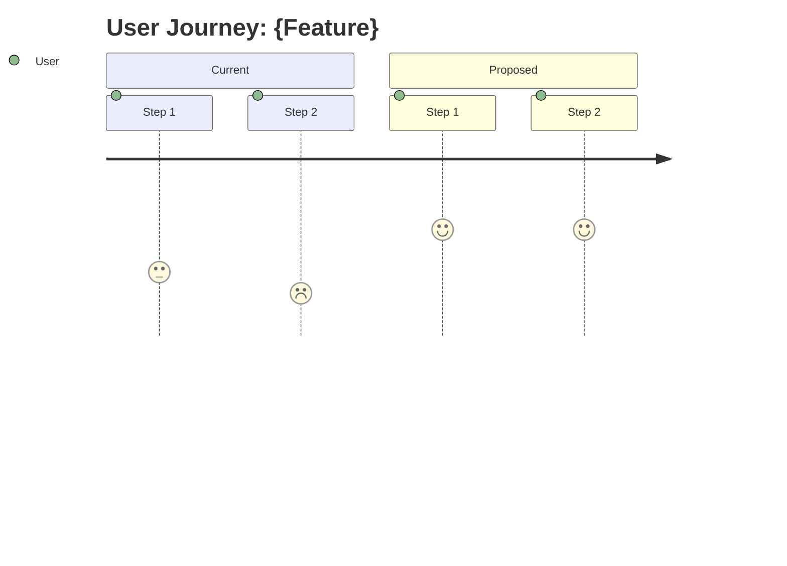
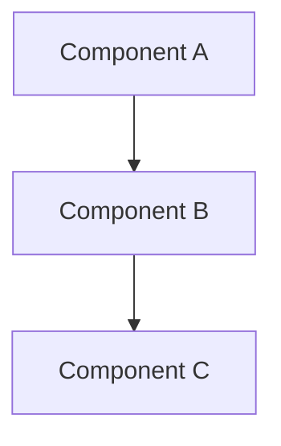
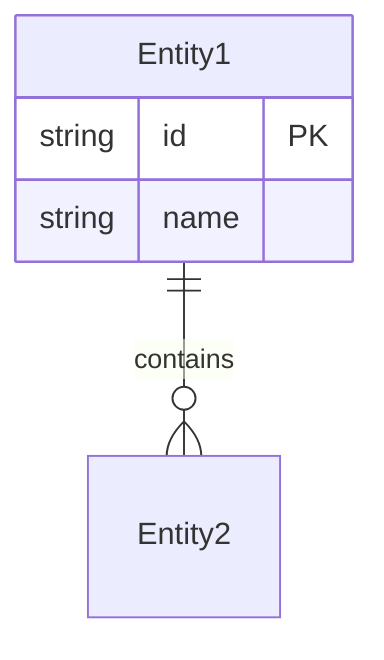
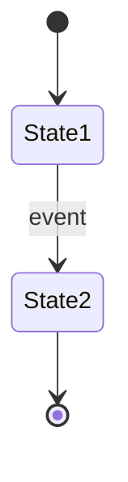

# Feature Design Planning Workflow

**Feature:** $ARGUMENTS

---

## Setup

1. Derive a kebab-case slug from the feature description (e.g., "user authentication system" → `user-auth-system`)
2. Create directory: `designs/{slug}/`
3. Create `designs/{slug}/REQUIREMENTS.md` with the original feature request

---

## Phase 1: Discovery & Clarification

Before designing, fully understand the problem space and constraints.

**Exploration Process:**

- Analyze relevant parts of the existing codebase using Read, Glob, Grep tools
- Identify existing patterns, conventions, and architectural decisions
- Map out integration points and dependencies
- Note constraints (technical, business, performance)

**If the feature is clear and well-scoped:**
- Skip to Phase 2 after brief exploration
- Document any assumptions in REQUIREMENTS.md

**If the feature needs clarification:**
- Add questions to REQUIREMENTS.md
- Wait for user answers, then append answers to REQUIREMENTS.md

**What to clarify:**

- **Functional requirements**: What exactly should this feature do?
- **Non-functional requirements**: Performance, scalability, security constraints?
- **Scope boundaries**: What's in vs. out of scope?
- **User personas**: Who uses this and how?
- **Integration**: How does this interact with existing systems?
- **Success criteria**: How do we know when it's done right?

**Quality of questions matters:**

- Ask about specific behaviors (e.g., "When a user does X, should the system respond with Y or Z?")
- Ask about edge cases (e.g., "What happens when the input exceeds 10MB?")
- Ask about constraints (e.g., "Is there a latency budget for this API?")
- Ask about trade-offs (e.g., "Should we optimize for read performance or write consistency?")
- Be thorough - 5-10 well-thought-out questions is better than 2-3 vague ones

**ITERATIVE Q&A:**

- ASK AS MANY ROUNDS OF QUESTIONS AS YOU NEED
- Append each round of Q&A to REQUIREMENTS.md
- Only proceed to design when confident you understand the full scope
- It's BETTER to ask too many questions than to make assumptions

**REQUIREMENTS.md Template:**

```markdown
# Requirements: {Feature Name}

## Original Request

{The original feature request from the user}

## Assumptions

{Any assumptions made - update as needed}

## Q&A

### Round 1

**Q:** {Question}
**A:** {Answer}

{Add more rounds as needed}
```

**⏸ CHECKPOINT**: When you have no more questions, say "Discovery complete. Say 'continue' for Phase 2"

---

## Phase 2: Design Document

Produce a comprehensive design document at `designs/{slug}/DESIGN.md`.

The design document has **8 sections**:
1. Overview (problem, goals, non-goals)
2. Background & Context
3. Proposed Design (architecture, data model, API, components)
4. Non-functional Considerations (performance, security, reliability)
5. Alternatives Considered
6. Dependencies & Risks
7. Implementation Roadmap
8. Open Questions

**All sections below are part of the DESIGN.md template.**

---

**CRITICAL: Citation Requirements**

Every code reference MUST include file path and line number:
- Single line: `path/to/file.py:42`
- Line range: `path/to/file.py:42-58`
- Function reference: `path/to/file.py:42` (the `function_name` function)

**Diagram Guidelines:**

Use Mermaid diagrams liberally:
- `flowchart` - Architecture, data flow, component relationships
- `sequenceDiagram` - API interactions, process flows
- `erDiagram` - Data models, entity relationships
- `stateDiagram-v2` - State machines, lifecycle
- `classDiagram` - Class/module relationships
- `journey` - User journeys

**Design Document Structure:**

```markdown
# Feature Design: {Feature Name}

**Status:** Draft | In Review | Approved
**Author:** {name}
**Created:** {date}
**Last Updated:** {date}

## 1. Overview

### 1.1 Problem Statement
{What problem does this feature solve?}

### 1.2 Goals
- {Primary goal}
- {Secondary goals}

### 1.3 Non-Goals (Out of Scope)
- {What this feature explicitly does NOT do}

## 2. Background & Context

### 2.1 Current State
{How does the system work today? Include citations.}

Key files:
- `path/to/file.py:10-50` - {description}

### 2.2 User Journey
{How do users interact with this feature?}



## 3. Proposed Design

**Design Principles:**
- Follow established software engineering patterns (SOLID, DRY, separation of concerns)
- Match existing patterns and conventions in the codebase
- Prefer simplicity over cleverness

### 3.1 Architecture Overview



### 3.2 Data Model

{New or modified data structures}



### 3.3 API Design

{New or modified APIs}

#### Endpoint: `POST /api/v1/resource`

**Request:**
```json
{
  "field1": "value",
  "field2": 123
}
```

**Response:**
```json
{
  "id": "abc123",
  "status": "created"
}
```

**Error Codes:**
| Code | Description |
|------|-------------|
| 400  | Invalid input |
| 409  | Resource already exists |

### 3.4 Component Design

{Detailed design of each component}

#### Component: {Name}

**Responsibilities:**
- {What it does}

**Interfaces:**
- {How other components interact with it}

**Implementation Notes:**
- {Key implementation details}

### 3.5 State Machine (if applicable)



## 4. Non-functional Considerations

### 4.1 Performance
- Expected load: {requests/sec, data volume}
- Latency requirements: {p50, p99 targets}
- Scaling strategy: {horizontal, vertical, caching}

### 4.2 Security
- Authentication: {method}
- Authorization: {who can do what}
- Data sensitivity: {PII, encryption needs}

### 4.3 Reliability
- Failure modes: {what can go wrong}
- Recovery strategy: {how to recover}
- Monitoring: {key metrics to track}

### 4.4 Backwards Compatibility
- Breaking changes: {yes/no, what}
- Migration strategy: {how to migrate}

## 5. Alternatives Considered

### Alternative 1: {Name}

**Description:** {Brief description}

**Pros:**
- {advantage}

**Cons:**
- {disadvantage}

**Why not chosen:** {reason}

### Alternative 2: {Name}

{Same structure}

## 6. Dependencies & Risks

### 6.1 Dependencies
| Dependency | Type | Risk Level | Mitigation |
|------------|------|------------|------------|
| Service X  | Hard | Medium     | Fallback to Y |

### 6.2 Risks
| Risk | Likelihood | Impact | Mitigation |
|------|------------|--------|------------|
| Risk 1 | Medium | High | Strategy |

## 7. Implementation Roadmap

### Prerequisites

- {Any setup needed before starting, e.g., feature flag, dependencies}

### Milestone 1: {Milestone Name}

**Goal:** {What this milestone achieves}
**Files:** {Files to create or modify}
**Verification:** {How to verify - test command or manual check}

### Milestone N: {Milestone Name}

{Add as many milestones as needed}

**Roadmap Guidelines:**
- Each milestone = one commit with all tests passing
- High-risk milestones should come early (fail-fast)
- Dependencies must be sequenced correctly

## 8. Open Questions

- [ ] {Question that still needs answering}
- [ ] {Another open question}

---

## Phase 3: Design Review

Launch a **fresh sub-agent** to review the design with unbiased perspective.

**Use the Task tool:**

```
Task tool call:
  subagent_type: "general-purpose"
  description: "Staff engineer design review"
  prompt: |
    You are a staff engineer conducting a design review.

    **Read these files:**
    1. designs/{slug}/REQUIREMENTS.md (original request, assumptions, Q&A)
    2. designs/{slug}/DESIGN.md (the design to review)

    **Review checklist:**
    - Completeness: All requirements addressed? Edge cases handled?
    - Correctness: Design solves the problem? Assumptions valid?
    - Clarity: Understandable? Diagrams accurate? Terms defined?
    - Feasibility: Can be implemented? Dependencies available?
    - Scalability: Handles expected load? Growth path clear?
    - Security: Auth addressed? Data protected? Input validated?
    - Maintainability: Follows patterns? Testable? Observable?
    - Simplicity: No over-engineering? YAGNI followed?

    **Your task:**
    DIRECTLY EDIT DESIGN.md to fix issues and improve the design:
    - Fix any issues you find
    - Add missing details
    - Improve clarity
    - Move unresolved concerns to "Section 8: Open Questions"
    - Append a new section to provide a brief summary of changes made

    Be critical but constructive. The goal is a better design.
```

**Why a fresh sub-agent?**
- Unbiased review (no context from design authoring)
- Catches issues the author missed due to tunnel vision
- Simulates real code review from another engineer

**After sub-agent completes:**
1. Read the updated DESIGN.md
2. Review the changes (use git diff if needed)
3. If needed, make additional refinements

---

## Complete

When complete, the `designs/{slug}/` directory should contain:

| File | Purpose |
|------|---------|
| `REQUIREMENTS.md` | Original request, assumptions, Q&A |
| `DESIGN.md` | Comprehensive design document (reviewed and finalized) |

Say "Design complete. Ready for implementation: `designs/{slug}/DESIGN.md`", to ask for human review.
