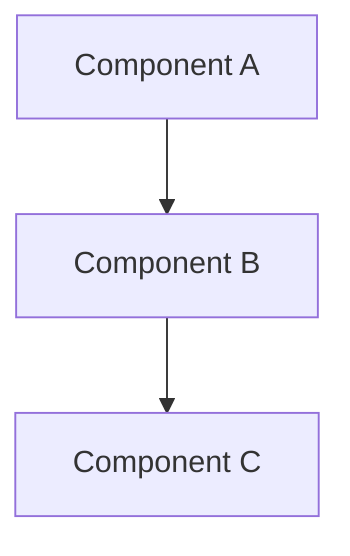

# Research & Exploration Workflow

**Research Topic:** $ARGUMENTS

---

## Setup

1. Derive a kebab-case slug from the research topic (e.g., "How does auth work" → `auth-flow`)
2. Create directory: `research/{slug}/`

---

## Phase 1: Clarification (If Needed)

Before diving into exploration, assess whether the research topic is clear or needs clarification.

**If the topic is clear and specific:**
- Skip directly to Phase 2 (Exploration)
- No questions needed

**If the topic is ambiguous or broad:**
- Write questions to `research/{slug}/QUESTIONS-1.md`
- Wait for user answers before proceeding

**What to clarify:**

- **Key Research Questions**: What specific questions does the user want answered?
- **Scope boundaries**: What should be included vs. excluded?
- **Depth**: High-level overview or detailed implementation analysis?
- **Focus areas**: Which parts of the system matter most?

**Quality of questions matters:**

- Ask about specific technical areas (e.g., "Should I focus on the auth flow or the data layer?")
- Ask about boundaries (e.g., "Should I include the test infrastructure in this research?")
- Ask about depth (e.g., "Do you want a high-level overview or detailed implementation analysis?")
- Ask about deliverables (e.g., "What questions do you want answered in the findings?")
- Be thorough - 3-5 well-thought-out questions is better than vague ones

**ITERATIVE Q&A:**

- ASK AS MANY ROUNDS OF QUESTIONS AS YOU NEED
- QUESTIONS-1, wait for answers, then QUESTIONS-2 if needed, etc.
- Only proceed to exploration when confident you understand the scope
- It's BETTER to ask too many questions than to make assumptions

**Questions File Template:**

When creating QUESTIONS-*.md files, use this format:

```markdown
<!-- INSTRUCTIONS FOR ANSWERING QUESTIONS -->
<!--
- Answer each question inline below the question
- You can edit the questions if they're unclear
- Add your answers under each question
- When done, save the file and let me know
-->

## Q1: Your first question here

## Q2: Your second question here

---

## Key Questions You Want Answered

What specific questions should this research answer? List them here:

1.
2.
3.

---

## Anything else you'd like to mention?

**Additional context or clarifications:**


<!-- Save this file when you're done -->
```

---

## Phase 2: Exploration & Synthesis

Now dive deep into the codebase and produce a comprehensive findings report.

**Exploration Process:**

- Trace code paths systematically from entry points
- Document component relationships and dependencies
- Identify patterns, conventions, and architectural decisions
- Note any surprising or non-obvious behavior
- Use Read, Glob, Grep tools extensively

**CRITICAL: Citation Requirements**

Every code reference MUST include file path and line number in this format:
- Single line: `path/to/file.py:42`
- Line range: `path/to/file.py:42-58`
- Function reference: `path/to/file.py:42` (the `function_name` function)

Examples:
```markdown
Authentication is handled in `apps/apis/assistant_api/main.py:85-120`
The token validation logic in `libs/py/request_context/auth.py:142` checks...
See the `validate_request` function at `internal/middleware/auth.go:67`
```

**Create `research/{slug}/FINDINGS.md` with this structure:**

```markdown
# Research Findings: {Topic}

## Original Prompt

{The exact $ARGUMENTS text}

## Executive Summary

{2-3 sentence overview of key findings}

## Architecture Overview

{High-level description of how the system works}



## Detailed Findings

### {Section 1: Key Area}

{Detailed explanation with file:line citations}

Key files:
- `path/to/main/file.py:10-50` - {description}
- `path/to/other/file.py:100` - {description}

### {Section 2: Another Key Area}

{Continue with more sections as needed}

## Answers to Research Questions

### Q1: {Question from clarification or derived during exploration}

**Answer:** {Detailed answer with citations}

### Q2: {Next question}

**Answer:** {Detailed answer with citations}

## Key Insights

- {Insight 1}
- {Insight 2}
- {Continue as needed}

## Recommendations (if applicable)

- {Any suggestions for improvements or further investigation}

## Appendix: Key Files Reference

| File | Lines | Purpose |
|------|-------|---------|
| `path/to/file.py` | 10-50 | Description |
| `path/to/file.py` | 100-150 | Description |
```

**Diagram Guidelines:**

Use Mermaid diagrams to illustrate:
- Architecture/component relationships (flowchart)
- Data flow (flowchart or sequenceDiagram)
- Class/module relationships (classDiagram)
- State machines (stateDiagram-v2)

**Quality Checklist:**

- [ ] All code references include file:line citations
- [ ] All research questions are answered
- [ ] At least one diagram illustrating architecture/flow
- [ ] Executive summary captures the essential findings
- [ ] Key files reference table is complete

**Completion:**

When FINDINGS.md is complete, present a brief summary highlighting the most important discoveries and ask if the user wants any clarifications or deeper dives into specific areas.
